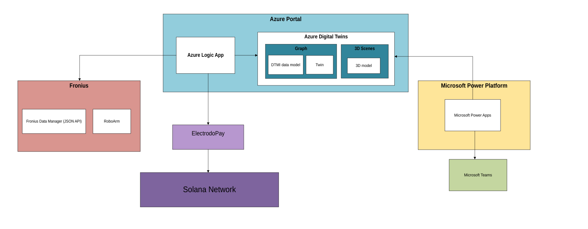

## **Description**

Electrodo Pay is a Web3 payment engine integrated into the Electrodo platform, designed to enable transaction-based monetization of autonomous market agents operating within industrial and ESG data ecosystems.

The service facilitates micropayments using both SOL (Solana native token) and eLTD \- Electrodo’s utility token \- allowing for seamless, programmable, and low-cost compensation for agent-based services such as market brokerage, data analysis, predictive modeling, risk assessment, ESG verification, and decision-making.

## **Key Capabilities**

* **Autonomous Agent Monetization:** Agents can receive real-time payments for completing tasks, such as forecasting, optimization, or ESG assessments.  
* **Multi-token Support:** Secure, efficient transactions in **SOL** and **eLTD**, leveraging Solana’s high-speed and low-fee infrastructure.  
* **Programmable Settlement Logic:** Smart contracts govern the distribution of funds (e.g., splits between agent, platform, treasury).

## **About Electrodo platform**

**Electrodo** is a flagship FinTech platform by **482.solutions** for **ESG data and asset management**, purpose-built to empower **industrial SMEs**, **clusters**, and **impact investors**. By leveraging advanced economic agents, the platform helps users improve capitalization efficiency and co-create measurable, sustainable value across industrial value chains.

## **How it works**

Electrodo democratizes access to advanced tools traditionally available only to large corporations \- **Digital Twins**, **operations research (OR)**, and **econometric models** \- and adapts them for the needs of **SMEs and mid-sized industrial enterprises**. 

This enables tangible improvements in:

* **CAPEX/OPEX optimization**  
* **Equity valuation uplift**  
* **Sustainability-linked performance management**

## **Value Proposition**

**1\. For Industrial Enterprises**

Electrodo enables manufacturers and industrial businesses to manage operations and business processes to **maximize sustainable value creation**, leading to **stronger capitalization of industrial capital**.

**Key personas & Use cases:**

* **Business Owner / CFO:** *“Maximize company valuation pre-funding or exit.”*  
* **Operations Manager:** *“Optimize production scheduling under fluctuating demand and energy prices.”*  
* **Smart Agent provider:** *“Rapidly design, deploy and monetise Digital Twins and economic models without DevOps complexity.”*

**2\. For Impact Investors**

Electrodo provides actionable insights into the **performance, risks, and ESG potential** of industrial SMEs, helping investors identify and assess **sustainable and profitable investment opportunities**, thereby ensuring better capitalization of **financial capital**.

**Investor Benefits:**

* Access to verifiable ESG and operational performance data  
* Tools to match capital with impact-aligned industrial opportunities  
* Improved portfolio transparency and value growth

## **Archirecture**

